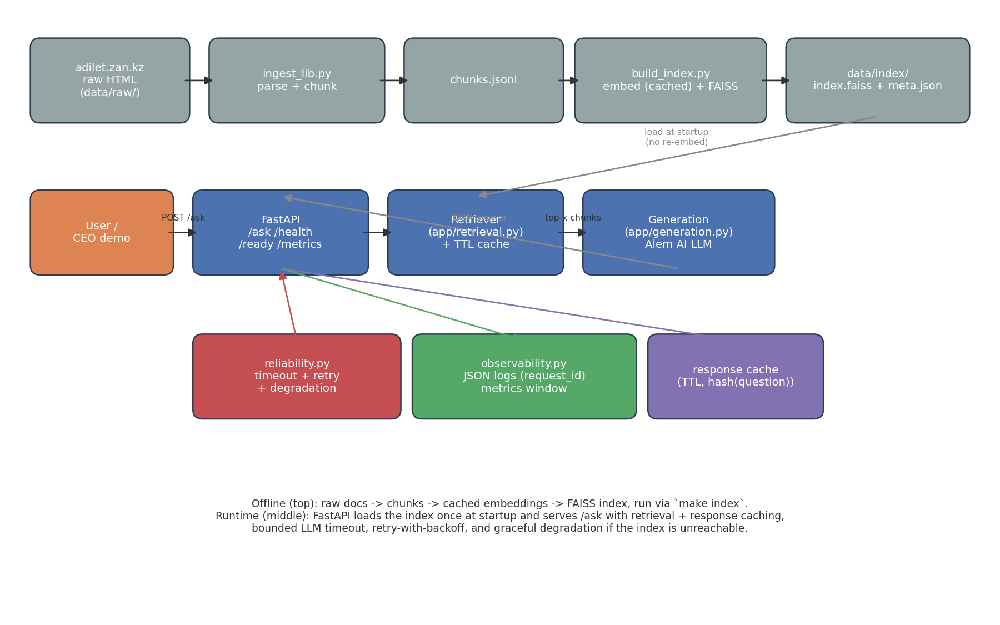
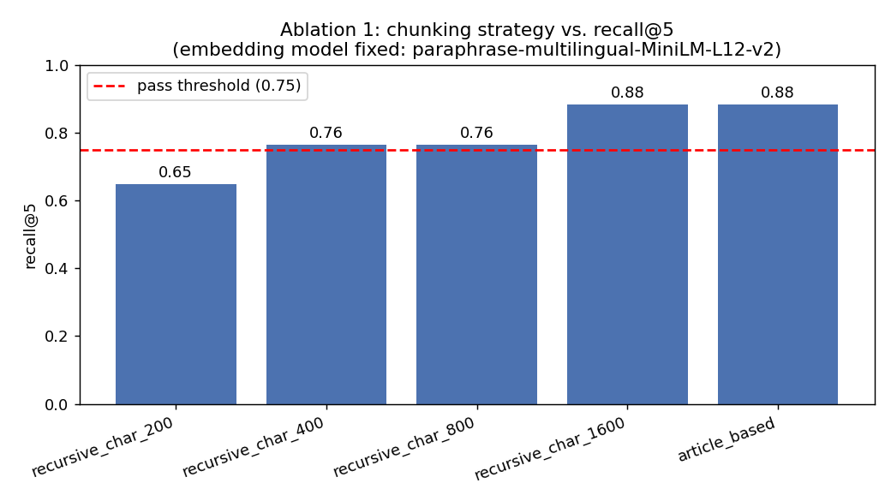
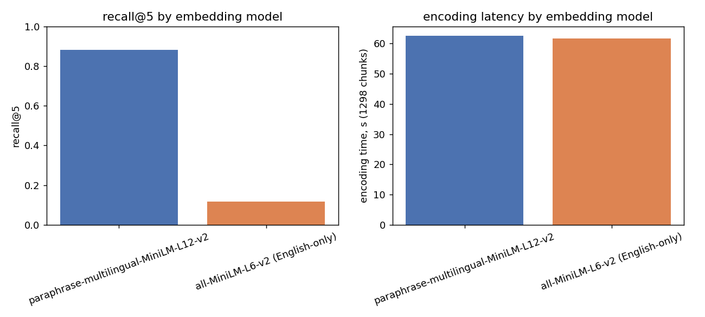

# Kazakh Labor & Tax Code RAG

## 1. What this project does

An internal "ask the docs" assistant for a Kazakhstani fintech: employees ask
questions in Russian about the **Labor Code** and **Tax Code** of the Republic
of Kazakhstan and get a grounded, source-cited JSON answer instead of having
to read the statute themselves. It is a full retrieval-augmented generation
pipeline — ingestion, chunking, embedding, indexing, retrieval evaluation,
generation, and a production FastAPI service with caching, reliability
patterns, and observability — built end-to-end by one engineer, as the RAID
role-play requires.

## 2. Corpus and licensing

- **Labor Code of the Republic of Kazakhstan** (Law No. 414-V, 23 Nov 2015,
  latest amendments), full text — 221 articles.
- **Tax Code of the Republic of Kazakhstan** ("О налогах и других
  обязательных платежах в бюджет", Law No. 214-VIII, effective 1 Jan 2026),
  curated to the chapters most relevant to a fintech's employees: general
  provisions, Corporate Income Tax, Individual Income Tax, VAT, and special
  tax regimes for small business — 405 articles.

Both are sourced from **adilet.zan.kz**, the official legal information
system of the Ministry of Justice of the Republic of Kazakhstan. Kazakhstani
legislation is public government text with no restriction on republication
for informational/educational use; raw HTML snapshots are committed under
`data/raw/` for full reproducibility. See `docs/adr/001-chunking-strategy.md`
for how the corpus is parsed and chunked.

## 3. Quickstart

```bash
python -m venv venv
source venv/bin/activate        # venv\Scripts\activate on Windows
pip install -r requirements.txt

cp .env.example .env            # fill in LLM_BASE_URL / LLM_API_KEY / LLM_MODEL
python scripts/build_index.py   # ~75s on a laptop CPU for the full corpus
uvicorn app.main:app --port 8000
```

or with `make`: `make install && make index && make serve`.

```bash
curl -X POST localhost:8000/ask \
  -H "Content-Type: application/json" \
  -d '{"question":"Сколько часов в неделю составляет нормальная продолжительность рабочего времени?"}'
```

```json
{
  "answer": "40 часов в неделю.",
  "sources": [
    {"law": "labor_code", "article_number": "68", "section_title": "Глава 6. РАБОЧЕЕ ВРЕМЯ / Статья 68. Нормальная продолжительность рабочего времени", "chunk_id": "labor_code:68:art:0", "score": 0.797}
  ],
  "confidence": 1.0,
  "used_context": true,
  "request_id": "4a61a24b-139a-4431-bf32-f24c3d0820cf",
  "degraded": false,
  "cache_hit": false,
  "prompt_version": "rag_v1",
  "latency_ms": {"embedding_ms": 63.47, "retrieval_ms": 0.39, "generation_ms": 3763.45, "total_ms": 3827.48}
}
```

## 4. Architecture



Offline: raw HTML → `ingest_lib.py` (parse + chunk) → `chunks.jsonl` →
`build_index.py` (cached embeddings + FAISS) → `data/index/`. Runtime:
FastAPI loads the index once at startup; `/ask` runs retrieval (with its own
cache) → generation (Alem AI LLM, OpenAI-compatible) → response, wrapped in
timeout/retry/degradation and logged with a `request_id`.

## 5. Retrieval quality

17 hand-authored ground-truth questions (`evaluation/ground_truth.jsonl`) —
numeric-fact, definition, and multi-chunk questions across both codes —
evaluated with `evaluation/evaluate_retrieval.py`:

| Metric | Value |
|---|---|
| recall@5 | **0.882** |
| MRR | 0.678 |
| Chunking strategy | `article_based` (one chunk per article, max 1600 chars) |
| Embedding model | `paraphrase-multilingual-MiniLM-L12-v2` |
| Mean query latency (retrieval only) | 24.8 ms |

Passes the 0.75 defense threshold comfortably and clears the 0.85 "target"
line. Per the RAID note for structured legal corpora, clearing 0.85 requires
explaining *why* — see the ablation below.

## 6. Ablation results

Two ablations, run in `notebooks/02_ablation.ipynb`:

**1. Chunk size / strategy sweep** (embedding model fixed):



| strategy | chunks | recall@5 | MRR | encode time |
|---|---|---|---|---|
| recursive_char_200 | 12,597 | 0.647 | 0.537 | 247.9s |
| recursive_char_400 | 6,361 | 0.765 | 0.582 | 197.4s |
| recursive_char_800 | 3,080 | 0.765 | 0.670 | 131.3s |
| recursive_char_1600 | 1,577 | 0.882 | 0.690 | 72.4s |
| **article_based** | **1,298** | **0.882** | 0.678 | **62.9s** |

Recall climbs monotonically with chunk size and plateaus at 0.88 once
chunks are large enough to hold a full article. Honest result:
`recursive_char_1600` and `article_based` are statistically tied on
recall@5 — chunk *size*, not the "respect article boundaries" heuristic, is
doing most of the work once chunks are big enough. `article_based` is still
the better production choice for reasons that don't show up in recall@5
alone: 18% fewer chunks, ~14% faster to build, and its chunk-to-article
mapping is exact by construction (not a byproduct of a large-enough
character window) — which is what gives `/ask`'s `sources` field clean,
correct citations regardless of where in the article the matched text falls.

**2. Embedding model comparison** (chunking fixed to `article_based`):



| model | recall@5 | MRR | encode time (1,298 chunks) |
|---|---|---|---|
| paraphrase-multilingual-MiniLM-L12-v2 | 0.882 | 0.678 | 62.5s |
| all-MiniLM-L6-v2 (English-only) | 0.118 | 0.125 | 61.7s |

Not a "measurably worse" result — a "wrong tool" result. `all-MiniLM-L6-v2`
was never trained on Russian text, so its tokenizer fragments Cyrillic into
near-meaningless subword pieces and cosine similarity degrades to noise
(0.118 recall is barely above what 5 random chunks out of 1,298 would give
by chance). The multilingual model costs essentially the same encode time
(62.5s vs 61.7s) for a 7.5x recall improvement — this is the mistake an
English-defaults tutorial would walk you into, and the ablation is what
catches it.

Full numbers: `evaluation/results/ablation_summary.json`.

## 7. Latency and cost budget

| | value |
|---|---|
| p50 latency, cold (no cache) | 1,803 ms |
| p95 latency, cold (no cache) | 4,093 ms |
| p50 latency, warm (response cache hit) | 1.5 ms |
| p95 latency, warm (response cache hit) | 2.6 ms |
| mean tokens / request | ~2,300 (system prompt + up to 5 retrieved chunks + answer) |
| estimated cost / 1,000 questions | ~2.3M tokens/1,000 req; at a representative small-model rate of ~$0.20/1M tokens blended, ≈ **$0.46 / 1,000 questions**. The Alem AI endpoint used in this deployment is a free educational quota with no published $ price, so this is a defensible reference estimate, not an actual bill. |

Generation dominates cold-path latency (1-4s per request, network-bound on
the third-party LLM); embedding + FAISS search together add well under
150ms. The 15s p95 defense threshold has ~4x headroom on a cold request and
the response cache turns a repeat question into a ~2ms lookup.

### Caching

Response cache (`app/main.py`, keyed by `hash(question)`, TTL =
`RESPONSE_CACHE_TTL_SECONDS`) plus a retrieval cache (`app/retrieval.py`,
keyed by `hash(question + index_version + top_k)`). Benchmarked by sending
the same 50 questions through `/ask` twice
(`scripts/bench_cache.py` → `evaluation/results/cache_benchmark.json`):

| pass | p50 | p95 |
|---|---|---|
| cold (cache empty) | 1,802.8 ms | 4,093.3 ms |
| warm (same 50 questions repeated) | 1.5 ms | 2.6 ms |

A cache hit skips both the query embedding call and the LLM round-trip
entirely, which is why the effect is ~1,500x rather than a modest percentage
— on this workload the LLM call is the entire cost, so caching it away is the
single highest-leverage latency optimization available.

**Invalidation strategy:** TTL expiry (default 1 hour, `RESPONSE_CACHE_TTL_SECONDS`
in `.env`). We chose TTL over an `index_version`-bump or manual-invalidate
endpoint because the corpus (a codified law) changes on the order of months,
not minutes — a cache correctness bug from staleness is far less likely than
in a corpus that changes daily, so the simplest invalidation strategy is
the right one here.

## 8. What happens when it breaks

| Failure | Component | Observable behavior |
|---|---|---|
| Vector index/FAISS unreachable or corrupted | `app/retrieval.py` via `reliability.safe_retrieve` | `POST /ask` still returns **HTTP 200** with `{"degraded": true, "answer": "Не удалось выполнить поиск по документам прямо сейчас...", "sources": []}` instead of crashing. Unit-tested in `tests/test_reliability.py::test_safe_retrieve_wraps_backend_failure`. |
| LLM call exceeds `LLM_TIMEOUT_SECONDS` (default 20s) | `app/generation.py` via `reliability.call_with_timeout` | `POST /ask` returns **HTTP 504** with body `{"error": "llm_timeout", "request_id": "..."}`. Unit-tested in `tests/test_reliability.py::test_call_with_timeout_raises_on_slow_call`. |
| LLM call fails transiently (connection reset, 5xx, 429) | `app/generation.py` via `reliability.with_retry` | Retried up to 3 attempts, 1s → 2s → 4s backoff; if all 3 fail, `POST /ask` returns **HTTP 503** `{"error": "llm_unavailable", "request_id": "..."}`. Unit-tested in `test_retry_recovers_after_two_transient_failures` / `test_retry_gives_up_after_3_attempts`. |
| Retrieved context is irrelevant to the question | `app/generation.py` | Deterministic refusal without an LLM call if the top score is below `RELEVANCE_SCORE_FLOOR` (0.25); otherwise the prompt itself instructs the model to refuse. Tested in `tests/test_prompt.py`. |
| Invalid request (`question` empty/too long/missing) | `app/schemas.py` (Pydantic) | **HTTP 422** with a field-level validation error, never a 500. Tested in `tests/test_api.py`. |

Most likely to happen first in production: the LLM timeout/transient-failure
path, since the Alem AI endpoint is a shared third-party service outside our
control — the vector index and validation layers are entirely local and far
more predictable.

Re-running the notebooks interactively needs Jupyter: `pip install -r requirements-dev.txt`.

### Smoke test

`scripts/smoke_test.py` sends 100 random-length questions (derived from the
ground truth set, truncated to random lengths ≥3 chars) through `/ask` in a
single run and checks for crashes / memory leaks, per the RAID §6
requirement:

```
Sent 100 requests in 147.2s
Status codes: [200] (counts: {200: 100})
Server-side crashes (5xx or exception): 0
Latency ms: min=4.4 mean=1471.8 max=6684.9
Traced Python heap: start=240.9MB end=256.7MB delta=+15.9MB

SMOKE TEST PASSED: no crashes, no 5xx responses.
```

Full log: `evaluation/results/smoke_test.log`.

## Testing

```bash
pytest tests/ -v
```

- `test_api.py` — endpoint behavior (422s, cache hit, response shape) with the real index loaded, LLM mocked.
- `test_prompt.py` — prompt regression suite (`rag_v1`), calls the **real** configured LLM backend; 2 deterministic refusal tests need no backend.
- `test_reliability.py` — timeout, retry, and degradation unit tests with mocked failures.
- `test_retrieval.py` — asserts recall@5 ≥ 0.75 against the built index (run `make index` first).

## Observability

Example log lines (stdout, one JSON object per line):

```json
{"timestamp": "2026-07-07T23:58:42Z", "level": "INFO", "logger": "rag", "message": "request_completed", "request_id": "4a61a24b-139a-4431-bf32-f24c3d0820cf", "question": "Сколько часов в неделю составляет нормальная продолжительность рабочего времени?", "retrieved_chunk_ids": ["labor_code:68:art:0", "labor_code:71:art:0", "labor_code:78:art:0", "labor_code:84:art:0", "labor_code:83:art:0"], "prompt_version": "rag_v1", "model_name": "alemllm", "latency_ms_by_stage": {"embedding_ms": 63.47, "retrieval_ms": 0.39, "generation_ms": 3763.45, "total_ms": 3827.48}, "token_usage": 2123, "answer_length": 18, "cache_hit_bool": false, "error_bool": false}
```

Failure example (degraded retrieval):

```json
{"timestamp": "2026-07-07T23:58:42Z", "level": "ERROR", "logger": "rag.reliability", "message": "retrieval backend failure"}
{"timestamp": "2026-07-07T23:58:42Z", "level": "INFO", "logger": "rag", "message": "request_completed", "request_id": "a05f9cbf-c16b-4f12-b3fc-8521145620e3", "question": "Какая ставка НДС в Казахстане?", "retrieved_chunk_ids": [], "prompt_version": "rag_v1", "model_name": "alemllm", "latency_ms_by_stage": {"embedding_ms": 0.0, "retrieval_ms": 0.0, "generation_ms": 0.0, "total_ms": 0.12}, "token_usage": 0, "answer_length": 72, "cache_hit_bool": false, "error_bool": true}
```

`GET /metrics` returns a rolling snapshot (last 100 requests): p50/p95
latency, error rate, cache hit rate, total tokens, and mean top-1 retrieval
score.

## Architecture Decision Records

- [`docs/adr/001-chunking-strategy.md`](docs/adr/001-chunking-strategy.md) — why `article_based` chunking over pure `RecursiveCharacterTextSplitter` or semantic chunking.

## Docker (optional)

```bash
docker compose up --build
```

Builds the index inside the container on first start (cached afterwards via
the `./data` volume) and serves on port 8000.
